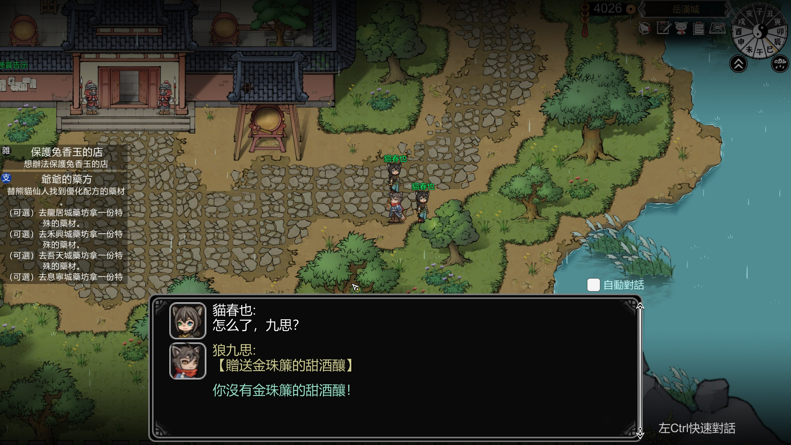
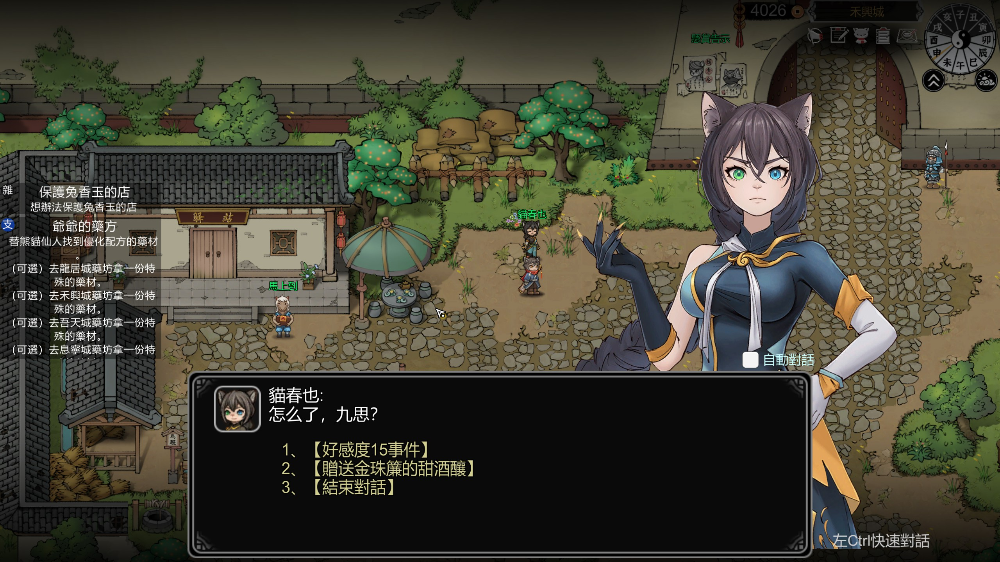
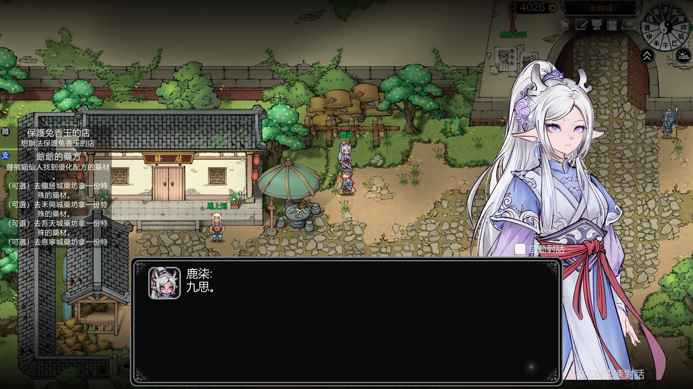

# 靈獸江湖 對話立繪外掛(DialoguePortraits)

> [!CAUTION]
> **本外掛從逆向分析、程式碼、對照表到本說明檔案,100% 由 AI(Anthropic Claude)開發完成。**
> 釋出者僅負責測試與提出需求。使用前請自行斟酌,問題回報歡迎開 Issue。

《靈獸江湖》(Beast Saga)的對話立繪外掛:**每一句**對話都顯示說話者的官方手繪立繪,
不再只有少數重要劇情才看得到。誰說話就切換成誰,對話結束自動收起,大幅提升對話沉浸感。

## 效果截圖

| 原版對話(只有小頭像) | 裝上外掛後(說話者立繪) |
|---|---|
|  |  |



## 適用遊戲版本

| 項目 | 版本 |
|---|---|
| 外掛版本 | v1.2.0(2026-07-05) |
| 開發/測試所用遊戲版本 | Steam build **24017669**(Unity 2021.3.1f1,IL2CPP) |

遊戲更新後外掛可能暫時失效(遊戲本體不受影響),處理方式見下方「遊戲更新後」章節。
其他版本理論上相容(掛勾走類別/方法名而非位址),但未逐一驗證。

- 完全使用遊戲內建的立繪顯示機制(與官方劇情演出同一套指令),觀感與官方一致
- 官方劇情自己有立繪/演出安排時,外掛自動讓位,不會打架
- **不修改任何遊戲檔案**,移除後 100% 還原
- 立繪素材用的是遊戲本地已有的 21 張官方手繪立繪,本外掛不包含任何遊戲素材

## 下載安裝(玩家)

1. 到 [Releases](../../releases) 下載最新的 `對話立繪外掛-完整安裝包-vX.X.X.zip`
2. 解壓,把「**安裝內容(全部複製到遊戲根目錄)**」資料夾裡的全部內容
   複製到遊戲根目錄(`BeastSaga.exe` 所在的資料夾,
   預設 `C:\Program Files (x86)\Steam\steamapps\common\Beast Saga\`)
3. 啟動遊戲。**第一次啟動會多花 1~2 分鐘**(框架初始化,只有第一次),
   會出現滾動文字的主控台視窗,屬正常現象
4. 找主要角色(貓春也、兔千千、猴千沖……)對話,立繪就會出現

> 防毒軟體可能對 `winhttp.dll` 誤報,這是 BepInEx 框架的注入方式造成的已知誤報,
> 加入白名單即可(所有 BepInEx 系 Mod 都一樣)。

### 移除 / 完全還原

刪除遊戲根目錄下這些「新增物」即可(遊戲原始檔案從未被修改):
`winhttp.dll`、`doorstop_config.ini`、`changelog.txt`、`BepInEx\`、`dotnet\`

### 設定

第一次執行後可編輯 `遊戲根目錄\BepInEx\config\beastsaga.dialogueportraits.cfg`:

| 設定 | 預設 | 說明 |
|---|---|---|
| `HideOnUnmapped` | true | 沒立繪的角色說話時收掉上一位的立繪 |
| `LogSpeakers` | true | 記錄每句話的說話者(補全對照表用) |
| `Verbose` | true | 詳細日誌,穩定後可關 |

不想看到啟動時的主控台視窗:`BepInEx\config\BepInEx.cfg` →
`[Logging.Console]` → `Enabled = false`。

### 補全立繪對照表

遊戲共有 21 張官方立繪,目前已對上 17 個角色,還有 4 張
(`rolefull_lu` / `rolefull_xueshan` / `rolefull_dutongzi` / `rolefull_xianglingshuang`)
不確定對應的角色名。遊玩時「說了話但沒立繪」的角色會記錄在
`BepInEx\plugins\DialoguePortraits\unmapped_speakers.txt`,
若發現疑似角色,在 `BepInEx\plugins\DialoguePortraits\portrait_map.json`
加一行(如 `"雪山": "rolefull_xueshan"`),重開遊戲即生效。
歡迎回報讓對照表更完整!其他角色是遊戲本來就沒畫立繪。

## 自行編譯(開發者)

環境:.NET 6 SDK 以上;已安裝本外掛並至少啟動過一次的遊戲
(編譯引用 `遊戲目錄\BepInEx\interop\` 的元件,路徑寫在 `src/DialoguePortraits.csproj` 的 `GameDir`)。

```
cd src
dotnet build -c Release
```

產物 `src/bin/Release/DialoguePortraits.dll` 複製到
`遊戲目錄\BepInEx\plugins\DialoguePortraits\` 即可。

### 目錄說明

| 路徑 | 內容 |
|---|---|
| `src/` | 外掛原始碼(單檔案 `Plugin.cs`) |
| `tools/parse_db.py` | 解析遊戲對話資料庫(`sharedassets0.assets`),產出角色表 |
| `tools/build_rolefull_map.py` | 拼音比對產出 `portrait_map.json` |
| `install.ps1` | 本機重部署指令碼(遊戲更新後用,`-Rebuild` 先重編譯) |

### 運作原理(維護筆記)

- 遊戲:Unity 2021.3.1f1 IL2CPP,對話系統 PixelCrushers Dialogue System,UI 為 FairyGUI
- 框架:BepInEx 6(IL2CPP,bleeding-edge)+ HarmonyX
- Harmony postfix `PixelCrushers.DialogueSystem.ConversationView.StartSubtitle`
  → 取 `subtitle.speakerInfo.nameInDatabase` 查 `portrait_map.json`
- 顯示/切換:`GameDialogueHelper.ShowCharacter("rolefull_xxx+null")`,
  收回 `HideCharacter("null")`(與官方劇情序列的
  `SendMessage(ShowCharacter,rolefull_xxx+null,Dialogue)` 同一路徑)
- `ConversationController.Close` postfix → 對話結束收立繪
- 劇情自己呼叫 `ShowCharacter`/`CreateFriendSet` 時(postfix 偵測非外掛呼叫),
  該場對話外掛整段讓位
- 玩家/旁白(動畫、嘴替等工具型說話者)說話時保留當前立繪不動
- 立繪素材:StreamingAssets 的 `rolefull_*` AssetBundle
  (可用官方 Mod 工具替換,能上創意工坊;外掛只負責「每句都顯示」的行為)

### 遊戲更新後

1. 刪除 `遊戲目錄\BepInEx\interop\`,啟動一次遊戲重新生成
2. 外掛若失效:`install.ps1 -Rebuild` 重編譯部署
3. 若掛勾點被改動(罕見),對照本節維護筆記修 `Plugin.cs`

## 免責宣告

非官方外掛,與遊戲開發商無關。僅供單機遊玩使用,不修改遊戲檔案、不含任何遊戲素材。
本倉庫程式碼採 MIT 授權;隨 Release 附帶的 [BepInEx](https://github.com/BepInEx/BepInEx)
為 LGPL-2.1 授權的開源專案。
